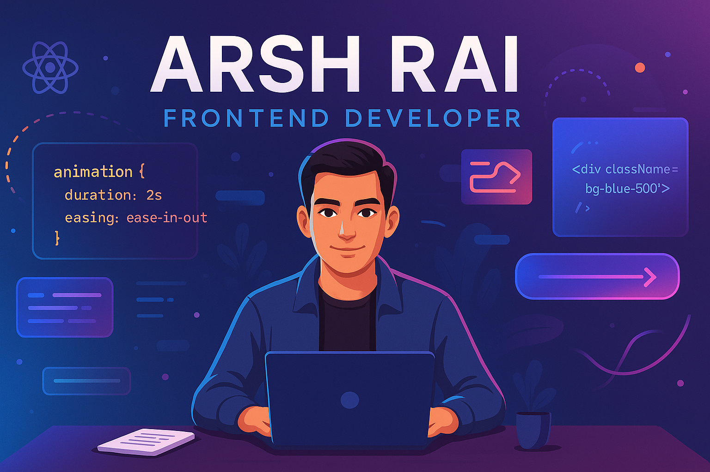

<!-- Profile Banner -->

  

<h1 align="center">Hi 👋, I'm Arsh Rai</h1>
<h3 align="center">💻 MERN Stack Developer | 🚀 Building Scalable Web Apps</h3>

---

## 🚀 About Me
I’m a passionate **MERN Stack Developer** focused on building scalable, maintainable, and user-friendly web applications.  
I love crafting clean code, exploring new technologies, and turning ideas into functional products.  

- 🌱 Currently learning **Advanced MERN Stack** and modern web development practices  
- 🛠 Skilled in **JavaScript, React, Node.js, MongoDB, Tailwind CSS**  
- 🎯 Committed to continuous learning and problem-solving  
- 💡 Strong believer in writing code that is **simple, efficient, and elegant**

---

## 🛠 Tech Stack

  
  
  
  
  
  
  

---

## 📊 GitHub Stats

  
  

---

## 🏆 Achievements

  

---

## 📫 Connect with Me

  
  
  

---

💡 *"Code is like humor. When you have to explain it, it’s bad."*
